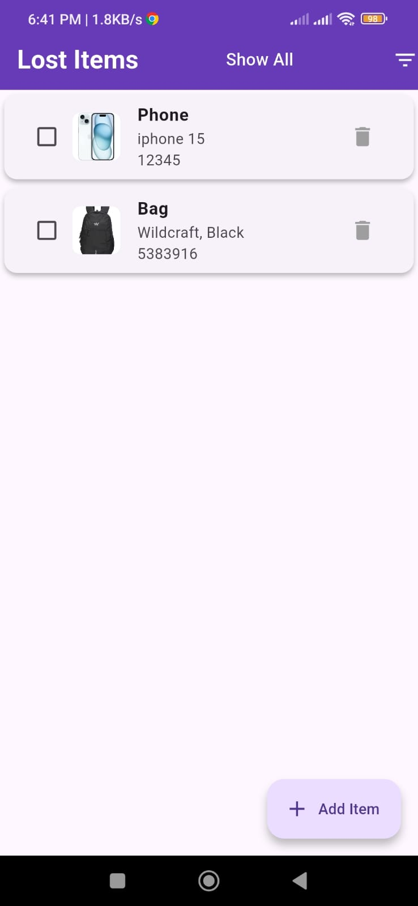
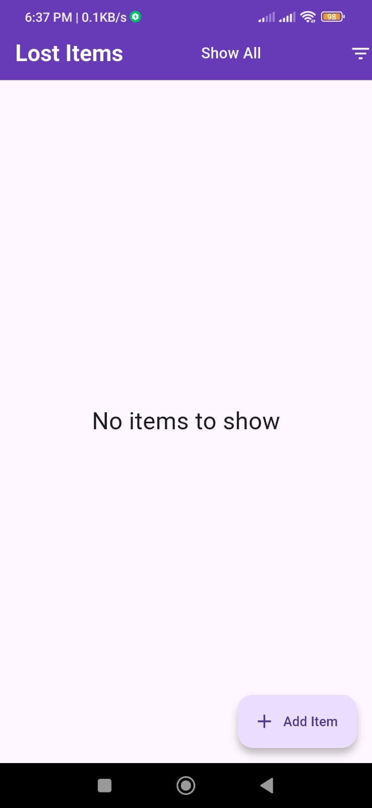
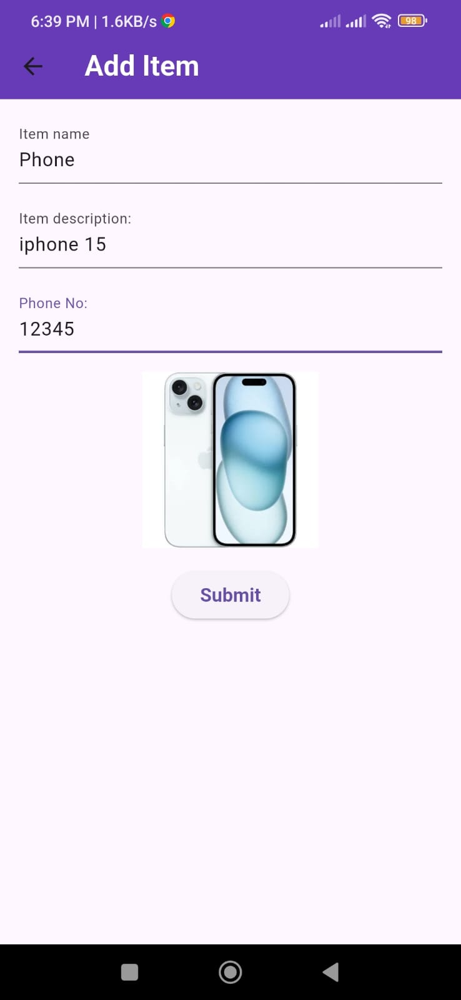
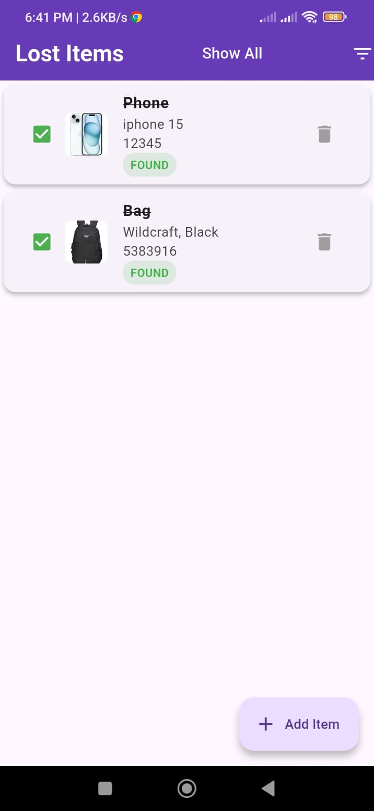
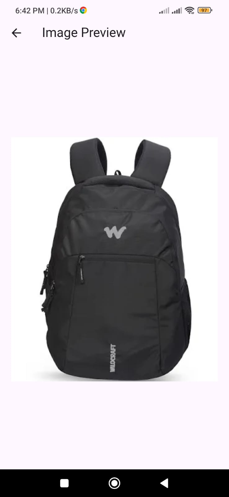
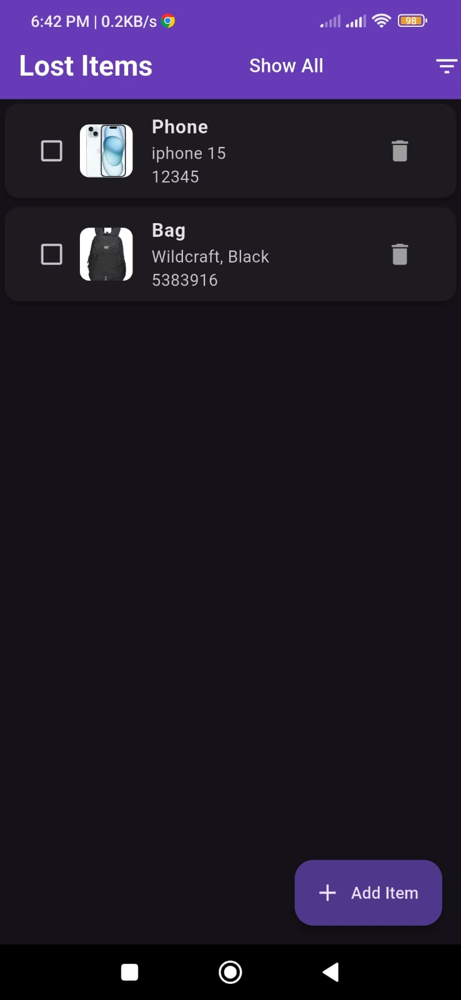
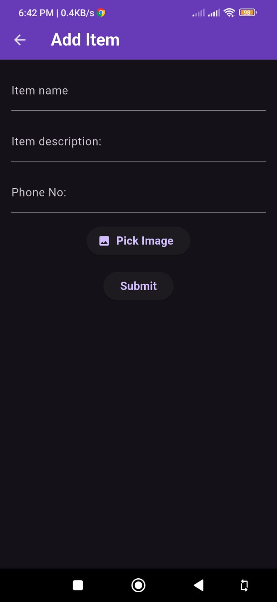

# Campus Lost & Found App

## APK Download
[Campus Lost & Found](https://github.com/shuaib05/lost_and_found/releases/download/v1.0.0/Campus.Lost.Found.apk)

## Overview
Campus Lost & Found is a simple offline mobile application built using **Flutter**.  
It allows users to report lost items, browse items reported by others, and mark items as found.  
All data is stored locally on the device.

---

## Features

### Core Features
- Add lost items with:
  - Item name
  - Description
  - Contact number
  - Optional image upload
- Display all items in a scrollable list
- Mark items as **Found / Not Found**
- Visual indication for found items
- Floating Action Button for navigation

### Bonus Features
- Filter items:
  - Show all items
  - Show only not-found items
- Local persistence using `shared_preferences`
- Image selection using device gallery
- Dark mode support

---

## Tech Stack
- **Framework:** Flutter
- **Language:** Dart
- **State Management:** setState
- **Local Storage:** shared_preferences
- **Image Handling:** image_picker
- **Version Control:** Git & GitHub

---

## Screenshots

## Light Mode

### Home Screen

### Home Screen Without Items

### Add Item Screen

### Adding an Item

### Marking Items as Found

### Image Preview

---

## Dark Mode

### Home Screen

### Add Item Screen

### Image Preview
